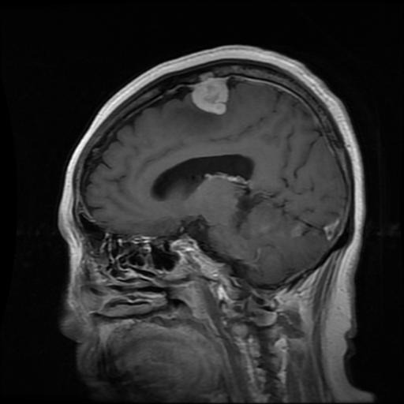
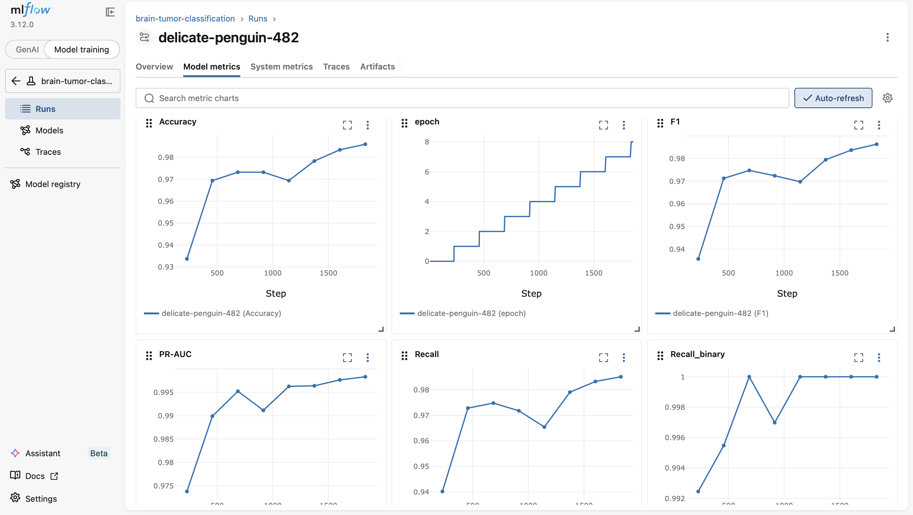
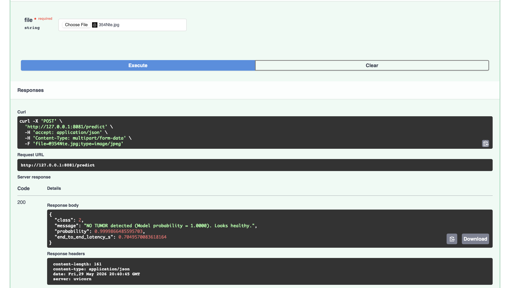

# MRI Brain Tumor Classification System

An end-to-end MLOps pipeline for brain tumor classification from MRI images using a fine-tuned EfficientNetV2-S architecture pretrained on ImageNet. This system covers the full machine learning lifecycle: automated data ingestion, preprocessing, reproducible pipeline orchestration, experiment tracking, model export, and inference serving using multiple backends.
## Problem Statement
The objective of this project is to accurately classify brain MRI images into four distinct categories:
* **Glioma**
* **Meningioma**
* **Pituitary Tumor**
* **No Tumor**

To ensure stable and computationally feasible training, all experiments were performed on Apple Silicon (M1) using the MPS backend under constrained computational resources, without access to dedicated GPU clusters. Under these constraints, the task was formulated as an image classification problem instead of a more computationally expensive object detection setting. This choice significantly reduces training complexity while preserving meaningful diagnostic capability and enables a complete and reproducible MLOps pipeline covering training, evaluation, export, and deployment.

---

## Dataset Specification
* **Source:** Kaggle (MRI Brain Tumor Dataset with Bounding Boxes)
* **Link:** [Kaggle Dataset Link](https://www.kaggle.com/datasets/ahmedsorour1/mri-for-brain-tumor-with-bounding-boxes)
* **Creator / Author:** Ahmed Sorour (Published: 2024)
* **Volume:** ~5,000 RGB MRI images + corresponding YOLO-formatted `.txt` annotation files (~140 MB total payload).
* **Processing Input:** Images are dynamically resized to $256 \times 256$ pixels and normalized according to calculated dataset-specific statistics using the `Albumentations` library.
* **Data Augmentations:** To enhance model generalization, prevent overfitting, and ensure robustness against clinical imaging variations, random spatial and color augmentations (such as flips, rotations, and brightness/contrast adjustments) are applied via `Albumentations` during the training phase.



*Figure 1: Example MRI image of a meningioma case from the dataset.*
###  Dataset Advantages & Key Strengths
* **Class Balance:** Unlike many medical datasets suffering from severe class imbalance, this dataset features a **highly balanced distribution** across all four target categories (glioma, meningioma, pituitary, and no tumor). This inherent balance eliminates the need for complex loss-weighting techniques or oversampling, enabling stable and unbiased objective function convergence.

### ⚠ Engineering Challenges & Solutions
* **Annotation Parsing:** The source dataset is structured for object detection, with label files containing bounding box coordinates (`[class_id, x_center, y_center, width, height]`). A custom preprocessing script was designed to robustly parse these `.txt` files, isolate the standalone `class_id` for each image, and seamlessly map them into a categorical classification format.
* **Rigorous Evaluation Strategy (Train/Val/Test Split):** To ensure a completely unbiased final performance evaluation, special care was taken to explicitly and cleanly isolate a **hidden Test set** alongside the standard Training and Validation sets (70/15/15 ratio). The splitting process enforces strict **stratification** to preserve identical class distributions across all three splits and uses a fixed random seed to guarantee complete pipeline reproducibility.
---

## Model Architecture
* **Backbone:** `EfficientNetV2-S`  pretrained on ImageNet, selected for its strong balance between accuracy and computational efficiency. EfficientNetV2-S is a lightweight variant of the EfficientNet family, designed to achieve high performance with significantly fewer parameters compared to larger architectures. This makes it particularly suitable for medical imaging tasks, where datasets are often limited in size and computational resources are constrained.
* The S (small) variant was chosen due to hardware limitations and the absence of large-scale GPU infrastructure. Despite its compact size, it retains strong representational power, which is critical for extracting subtle features in MRI brain scans. EfficientNet-based architectures are widely used in medical image analysis due to their strong transfer learning capabilities and robust performance on small to medium-sized datasets.
* **Fine-Tuning Strategy:** he model was fine-tuned using EfficientNetV2-S pretrained on ImageNet. During training, all feature extractor layers were initially frozen, and only the final **3 feature** blocks were unfrozen (n_unfrozen = 3), allowing task-specific adaptation while preserving pretrained representation.
* **Input Tensor:** `[Batch_Size, 3, 256, 256]` (RGB Image)
* **Output Layer:** A vector of raw logits mapped to the 4 target classes, converted to explicit prediction probabilities via a `Softmax` layer during inference.
* **Baseline Model:** Feature Extractor (Backbone): Completely **frozen** (`requires_grad = False`). The model leverages generic visual features (edges, textures, shapes) directly from ImageNet without modifying the underlying weights. **Classification Head:** **Unfrozen** and trained from scratch specifically on the 4-class brain tumor dataset (5k trainable parameters).

### ⚡ Key Advantage: Ultra-Fast Training
Because the heavy convolutional backbone is fully frozen and only the lightweight linear classifier head computes gradients, the training process is **extremely fast (near-instantaneous)**. This setup drastically reduces computational overhead, eliminates the risk of catastrophic forgetting in early layers, and allows the baseline to be trained efficiently within minutes, even in strict CPU or local Apple Silicon (MPS) environments.

---

## Performance Metrics & Validation

### Validation Strategy
* **Data Split:** Structured into **70% Training / 15% Validation / 15% Testing**.
* **Reproducibility:** Enforced via a fixed global random seed across all data loaders and operations.
* **Stratification:** Strict class stratification is applied during data splits to preserve identical target distributions across train, validation, and test subsets.

### Final Evaluation Results
The model demonstrates excellent generalization and high robustness, notably achieving perfect binary recall for tumor presence:

| Metric | Value | Baseline Value |
| :--- | :--- |:---------------|
| **Accuracy** | `0.9849` | `0.8584`       |
| **Recall (Macro)** | `0.9827` | `0.8687`       |
| **F1-Score (Macro)** | `0.9844` | `0.8634`       |
| **Precision-Recall AUC (PR-AUC)** | `0.9944` | `0.9331`       |
| **ROC-AUC** | `0.9976` | `0.9700`       |
| **Binary Recall (Tumor vs. No Tumor)** | `1.0000` | `0.9800`       |             |

A particularly important result is the near-perfect Binary Recall (Tumor vs. No Tumor), which reaches 1.0000 in the final model. In the medical context, recall is a critical metric as it directly reflects the model’s ability to avoid false negatives — i.e., not missing actual tumor cases.  This demonstrates that the model is highly reliable for screening purposes and prioritizes patient safety.

---

## Core System & MLOps Architecture

The system is fully decoupled into automated operational stages, enabling seamless execution from raw data to production serving:

```
[Raw MRI Data] ---> [DVC Preprocessing & Split] ---> [PyTorch Lightning Training]
                                                               |
   +-----------------------------------------------------------+
   |                                                           |
   v                                                           v
[MLflow Run Logs]                                      [Checkpoint Save] ------------- >[ONNX Serialization]
(Params, Metrics, Artifacts)                                                                |
                                                                                            v
                                                                             +--------------+--------------+
                                                                             v                             v
                                                                     [FastAPI Web Service]  <----+--->  [Triton Inference Server]
```

### 1. Training & Orchestration Pipeline (`DVC`)
The end-to-end pipeline is structured and version-controlled via **Data Version Control (DVC)**. Running `dvc repro` deterministically executes the following sequential stages:
1.  **Data Download & Extraction:** Pulls and verifies the raw source images.
2.  **Dataset Splitting:** Performs stratified splitting into train/val/test sets.
2.  **Preprocessing & Calculation:** Computes dataset-wide (on train dataset) normalization statistics and applies augmentations.
4.  **Model Training:** Executes training via **PyTorch Lightning** with automatic checkpointing based on validation loss.
5.  **Evaluation:** Evaluates the best model checkpoint against the test set, exporting metrics.
6.  **Model Export:** Converts the fine-tuned PyTorch weights into optimized ONNX format.
7.  **Triton Model Preparation:** Structures the generated ONNX file and write configuration rules into the local Model Repository format.

### 2. Experiment Tracking (`MLflow`)
Every pipeline run is tracked by **MLflow**. The system automatically logs:
* **Hyperparameters:** Learning rate.
* **Metrics:** Continuous training/validation loss curves, step-by-step accuracy, and final evaluation arrays.
* **Artifacts:** Best performing model checkpoints, confusion matrices.
 *Figure 2: MLflow dashboard.*
### 3. Model Export (`ONNX`)
To decouple the model from the PyTorch runtime and accelerate inference, the trained checkpoint is serialized to **ONNX (Opset Version 17)**:
* **Input Node Name:** `x`
* **Output Node Name:** `logits`

---

## 🚀 Inference Ecosystem & Deployment

The architecture implements a centralized inference strategy where **NVIDIA Triton Inference Server acts as the core execution engine**. Both the Web API and the CLI do not run the model locally; instead, they serve as specialized client interfaces that preprocess data and communicate directly with the Triton server.

The system provides three production-ready execution paths and components:

### A. Triton Inference Server Deployment Layer

The core production inference layer is powered by **NVIDIA Triton Inference Server**, hosting the fine-tuned `EfficientNetV2-S` model serialized into an optimized **ONNX** format.

The deployment pipeline automatically generates and versions a structured Triton Model Repository immediately following the training and export phases. This repository isolates the optimized model graph alongside its explicit configuration matrix (`config.pbtxt`).

####  Model & Serialization Specifications
* **Format:** ONNX (Opset Version 17)
* **Input Tensor Shape:** `[1, 3, 256, 256]` (Explicit batch size constraint of 1 for synchronous processing)
* **Output Tensor:** Raw logits mapped to the 4 target tumor classes.

####  Execution Environment & Runtime
* **Backend Provider:** Optimized ONNX Runtime CPU Backend.
* **Hardware Note:** Computation runs entirely on host CPU execution providers (Apple Silicon MPS framework is omitted within the Triton container environment to guarantee target system cross-compatibility).
* **Network Infrastructure:** Triton HTTP/REST Inference Server exposed natively on port `8000`, with optional support for gRPC protocol (port `8001`).

####  Performance & Latency Characteristics
* **Architecture Target:** Custom-tailored for low-latency, deterministic **single-image point inference** typical in clinical workstation diagnostic scenarios.
* **Inference Latency:** Executes within a profile of **~tens-hundreds of milliseconds** on modern CPUs.
* The measured end-to-end latency (~0.7s) includes preprocessing, network communication, Triton inference execution, and postprocessing.
* **Batching Strategy:** Dynamic request batching is explicitly disabled by default (`max_batch_size: 0` in configuration) to optimize and prioritize minimal processing latency for individual, real-time medical image queries **HTTP/REST** protocols.

### B. Lightweight REST API Gateway (FastAPI)
A highly optimized Python web service tailored for low-overhead client communication and public routing.
* **Proxy Architecture:** Acts as an API Gateway/BFF. It accepts raw binary image uploads from users, applies localized preprocessing (`Albumentations`), and **forwards the resulting tensors directly to Triton** via HTTP.
* **Response Payload:** Receives raw logits back from Triton, converts them into class probabilities via Softmax, and returns a structured JSON containing the predicted class, probabilities, and detailed end-to-end inference latency metrics.

### C. Command Line Interface (CLI)
A dedicated terminal utility designed for rapid diagnostics, automated batch scripts, or local engineering workflows.
* **Direct Triton Client:** It reads a local image path from terminal arguments, performs the required image transformations, **sends a synchronous inference request to the Triton server**, and prints the structured classification output directly to the console.
 *Figure 3: FastAPI interactive documentation demonstrating a successful brain tumor classification request.*
---

## ⚡ Quick Start & Pipeline Execution

> **Before running any training experiments**, ensure that the MLflow tracking server is active. All training runs, hyperparameters, metrics, and production artifacts are logged there for absolute reproducibility and downstream evaluation.

All project commands—spanning data processing, model training, evaluation, export, serving, and infrastructure management—are centralized inside the `Makefile`. **It is highly recommended to strictly use `make` targets** instead of executing underlying scripts manually to guarantee environment consistency and pipeline reproducibility.

### Example:
This will start the full MLOps infrastructure, including the MLflow tracking server, the complete DVC pipeline execution, and the launch of Triton Inference Server and MinIO services.
```bash
make run-mlflow
make dvc-repro
make run-gateway
make run-docker-all # start full Docker stack (run after dvc repro: model training + ONNX export + Triton repo generation)
```

## Technology Stack
* **Deep Learning Framework:** `PyTorch`, `PyTorch Lightning`
* **Computer Vision & Augmentation:** `Albumentations`
* **Pipeline & Data Versioning:** `DVC` (Data Version Control)
* **Experiment Metadata Server:** `MLflow`
* **Production Model Serving:** `Triton Inference Server`, `FastAPI`

---

## Key Architecture Decisions
1.  **Classification Shift:** Transitioning the problem statement from object detection to image classification drastically reduced computational overhead, enabling stable and efficient training on local environments (Apple Silicon / CPU) while preserving clinically meaningful diagnostic performance (tumor presence and type). This design choice was made to prioritize the development of a complete and reproducible MLOps pipeline, including training, experiment tracking, model export, and deployment, rather than focusing on computationally intensive detection modeling.
2.  **EfficientNet Transfer Learning:** Utilizing a highly optimized pretrained CNN allowed the system to hit over **98% accuracy** rapidly with a relatively small specialized dataset (~5,000 samples).
3.  **ONNX Portability:** Exporting checkpoints to ONNX ensures that the downstream deployment pipelines are completely independent of the training source code, enabling rapid execution across varying execution engines.

---
**Author:** Vadim Griaznov
